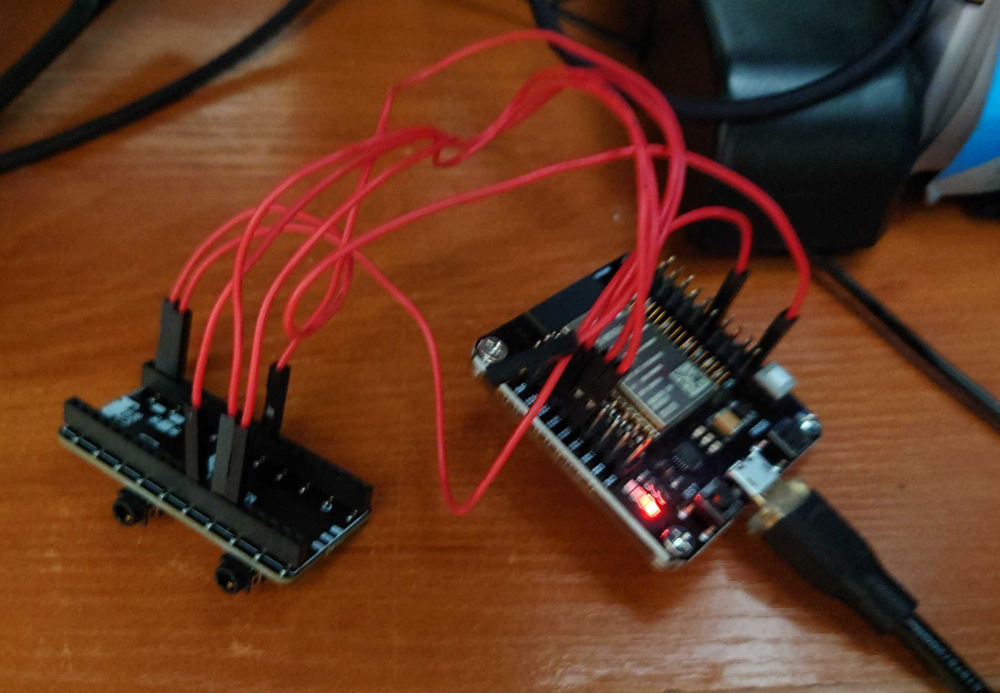

# Super-Simple-ESP32-Bluetooth-Receiver
This is a project aimed to use a ESP32 as an A2DP Bluetooth Speaker adapter

# Prerequisites:

# Hardware
* ESP32 board (compatible with A2DP. It is IMPORTANT)
* [Pimoroni Pico Audio Pack module](https://shop.pimoroni.com/products/pico-audio-pack)
* 5 pieces of wire

# Software
* Arduino IDE

# HowTo:
1. Check if Your ESP32 is able to handle A2DP. I have figured out (the hard way) that neither ESP32-S2 nor ESP32-C3 support A2DP so they are out of game. I have ended up using ESP32-WROVER-E ([pdf](https://www.espressif.com/sites/default/files/documentation/esp32-wrover-e_esp32-wrover-ie_datasheet_en.pdf)) with a [connector board](https://www.aliexpress.com/item/4000587174844.html) - worked as a charm.
2. Connect the Pico Audio Pack module as follows:
   * Pico Pin 39 to ESP32 5V pin
   * Pico Ground Pin to ESP32 Ground pin
   * Pico Pin 12 to ESP32 IO32
   * Pico Pin 14 to ESP32 IO25
   * Pico Pin 15 to ESP32 IO27
3. Connect the board to PC via USB cable
4. Select a correct board in the Arduino IDE. In case You go also for WROOM board as I did do the following:
   * Open File > Preferences
   * In the Additional boards manager URLs add this: `https://raw.githubusercontent.com/espressif/arduino-esp32/gh-pages/package_esp32_index.json` and save
   * In main menu Tools > Board > esp32 > ESP32 WROVER BOARD
   * check if port is correct, In my case that was ttyUSB0
   * partition scheme - select the option with minimal SPIFFS, otherwise you'll run out of space.
   * leave everything else as is.
5. close Arduino IDE
6. we need two libraries - AudioTools and BluetoothA2DPSink. Install it as follows:
  * `cd  ~/**whenever-your-ardiuno-libraries-are**/libraries`
  * `wget https://github.com/pschatzmann/arduino-audio-tools/archive/refs/tags/v0.9.8.tar.gz` - yes, don't just do git pull from main repo. It's broken at the moment of writing this manual
  * `tar -xvvf v0.9.8.tar.gz && rm v0.9.8.tar.gz`
  * `git clone https://github.com/pschatzmann/ESP32-A2DP.git`
7. Open Arduino IDE and open there an "ino" file from this repo. Compile, upload - that's it.

# Result

